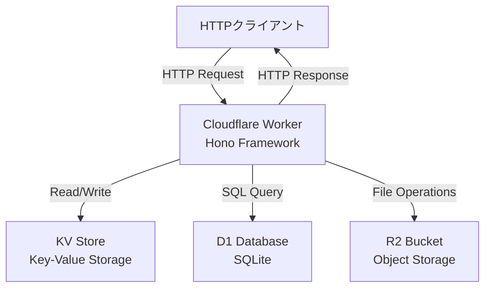
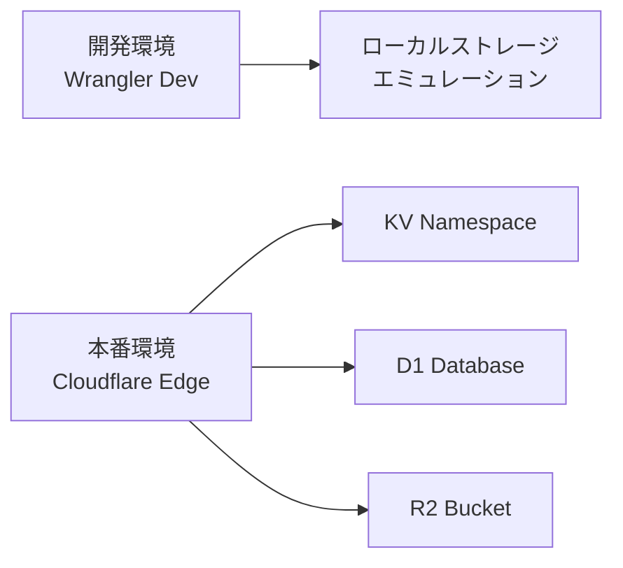

# Design Document: Cloudflare Demo Project

## Overview

このプロジェクトは、Cloudflare Workerを使用して、KV（Key-Valueストレージ）、D1（SQLデータベース）、R2（オブジェクトストレージ）の3つの主要なCloudflareストレージサービスを統合したデモアプリケーションです。Honoフレームワークを使用して軽量で高速なREST APIを実装し、各ストレージサービスの基本的なCRUD操作を提供します。

このアプリケーションは、Cloudflareのエッジコンピューティング環境で動作し、グローバルに分散されたインフラストラクチャを活用して低レイテンシーでのデータアクセスを実現します。

主な技術スタック:
- Cloudflare Workers（エッジランタイム）
- Hono（軽量Webフレームワーク）
- TypeScript（型安全性）
- Wrangler（CLIツール）

## Architecture

### システムアーキテクチャ



### レイヤー構造

1. **ルーティングレイヤー（Hono）**
   - HTTPリクエストのルーティング
   - ミドルウェア処理（CORS、エラーハンドリング）
   - リクエスト/レスポンスの変換

2. **ビジネスロジックレイヤー**
   - 各ストレージサービスへのアクセスロジック
   - データバリデーション
   - エラーハンドリング

3. **ストレージレイヤー**
   - KV: シンプルなキーバリューストレージ
   - D1: 構造化データ（SQLite）
   - R2: バイナリデータ/ファイルストレージ

### デプロイメントアーキテクチャ



## Components and Interfaces

### 1. メインWorkerエントリーポイント

**責務**: Honoアプリケーションの初期化とリクエストハンドリング

```typescript
interface Env {
  DEMO_KV: KVNamespace;
  DEMO_DB: D1Database;
  DEMO_BUCKET: R2Bucket;
}

// メインエクスポート
export default {
  fetch(request: Request, env: Env, ctx: ExecutionContext): Promise<Response>
}
```

### 2. KVストレージハンドラー

**責務**: KVストレージへのCRUD操作

**エンドポイント**:
- `POST /kv/:key` - キーバリューの保存
- `GET /kv/:key` - 値の取得
- `DELETE /kv/:key` - キーの削除
- `GET /kv` - 全キーのリスト取得

**インターフェース**:
```typescript
interface KVHandler {
  set(key: string, value: string): Promise<void>;
  get(key: string): Promise<string | null>;
  delete(key: string): Promise<void>;
  list(): Promise<string[]>;
}
```

### 3. D1データベースハンドラー

**責務**: D1データベースへのSQL操作

**エンドポイント**:
- `POST /d1/users` - ユーザー作成
- `GET /d1/users` - 全ユーザー取得
- `GET /d1/users/:id` - 特定ユーザー取得
- `PUT /d1/users/:id` - ユーザー更新
- `DELETE /d1/users/:id` - ユーザー削除

**インターフェース**:
```typescript
interface User {
  id?: number;
  name: string;
  email: string;
  created_at?: string;
}

interface D1Handler {
  createUser(user: Omit<User, 'id' | 'created_at'>): Promise<User>;
  getUsers(): Promise<User[]>;
  getUserById(id: number): Promise<User | null>;
  updateUser(id: number, user: Partial<User>): Promise<User>;
  deleteUser(id: number): Promise<void>;
}
```

### 4. R2ストレージハンドラー

**責務**: R2オブジェクトストレージへのファイル操作

**エンドポイント**:
- `POST /r2/:key` - ファイルアップロード
- `GET /r2/:key` - ファイル取得
- `DELETE /r2/:key` - ファイル削除
- `GET /r2` - オブジェクトリスト取得

**インターフェース**:
```typescript
interface R2Handler {
  put(key: string, data: ArrayBuffer | ReadableStream, contentType?: string): Promise<void>;
  get(key: string): Promise<R2ObjectBody | null>;
  delete(key: string): Promise<void>;
  list(): Promise<R2Object[]>;
}
```

### 5. ヘルスチェック/ルートハンドラー

**責務**: システムステータスとAPI情報の提供

**エンドポイント**:
- `GET /` - API一覧
- `GET /health` - ヘルスチェック

**インターフェース**:
```typescript
interface HealthStatus {
  status: 'healthy' | 'unhealthy';
  services: {
    kv: boolean;
    d1: boolean;
    r2: boolean;
  };
  timestamp: string;
}

interface APIInfo {
  name: string;
  version: string;
  endpoints: EndpointInfo[];
}
```

### 6. エラーハンドリングミドルウェア

**責務**: 統一されたエラーレスポンスの生成

```typescript
interface ErrorResponse {
  error: string;
  message: string;
  status: number;
  timestamp: string;
}
```

## Data Models

### KVストレージデータモデル

KVストレージは単純なキーバリューペアを保存します。

```typescript
// キー: 任意の文字列
// 値: 文字列（JSON文字列化されたオブジェクトも可）
type KVData = {
  [key: string]: string;
}
```

### D1データベーススキーマ

```sql
CREATE TABLE IF NOT EXISTS users (
  id INTEGER PRIMARY KEY AUTOINCREMENT,
  name TEXT NOT NULL,
  email TEXT NOT NULL UNIQUE,
  created_at DATETIME DEFAULT CURRENT_TIMESTAMP
);

CREATE INDEX IF NOT EXISTS idx_users_email ON users(email);
```

**TypeScript型定義**:
```typescript
interface User {
  id: number;
  name: string;
  email: string;
  created_at: string;
}

interface CreateUserInput {
  name: string;
  email: string;
}

interface UpdateUserInput {
  name?: string;
  email?: string;
}
```

### R2オブジェクトメタデータ

```typescript
interface R2ObjectMetadata {
  key: string;
  size: number;
  etag: string;
  httpEtag: string;
  uploaded: Date;
  httpMetadata?: R2HTTPMetadata;
  customMetadata?: Record<string, string>;
}

interface R2HTTPMetadata {
  contentType?: string;
  contentLanguage?: string;
  contentDisposition?: string;
  contentEncoding?: string;
  cacheControl?: string;
  cacheExpiry?: Date;
}
```

### リクエスト/レスポンスモデル

**KVリクエスト**:
```typescript
interface KVSetRequest {
  value: string;
}
```

**D1リクエスト**:
```typescript
interface CreateUserRequest {
  name: string;
  email: string;
}

interface UpdateUserRequest {
  name?: string;
  email?: string;
}
```

**統一エラーレスポンス**:
```typescript
interface ErrorResponse {
  error: string;
  message: string;
  status: number;
  timestamp: string;
}
```

**成功レスポンス**:
```typescript
interface SuccessResponse<T> {
  success: true;
  data: T;
  timestamp: string;
}
```


## Correctness Properties

A property is a characteristic or behavior that should hold true across all valid executions of a system-essentially, a formal statement about what the system should do. Properties serve as the bridge between human-readable specifications and machine-verifiable correctness guarantees.

### Property 1: JSON Response Format

For any valid API endpoint request, the response body should be valid JSON that can be parsed without errors.

**Validates: Requirements 1.3**

### Property 2: CORS Headers Present

For any HTTP request to the Worker, the response should include appropriate CORS headers (Access-Control-Allow-Origin).

**Validates: Requirements 1.4**

### Property 3: KV Storage Round Trip

For any key-value pair, storing a value in KV storage and then retrieving it by the same key should return the exact same value.

**Validates: Requirements 2.1, 2.2**

### Property 4: KV Deletion Removes Key

For any key that exists in KV storage, after deleting that key, attempting to retrieve it should result in a 404 response.

**Validates: Requirements 2.3**

### Property 5: KV List Contains Added Keys

For any key added to KV storage, the list of all keys should contain that key.

**Validates: Requirements 2.4**

### Property 6: D1 User Creation Round Trip

For any valid user data (name and email), creating a user in D1 database and then retrieving it by its ID should return a user with the same name and email.

**Validates: Requirements 3.2, 3.4**

### Property 7: D1 User List Contains Created Users

For any user created in D1 database, the list of all users should contain that user.

**Validates: Requirements 3.3**

### Property 8: D1 User Update Persistence

For any existing user and any valid update data, updating the user and then retrieving it should return the user with the updated values.

**Validates: Requirements 3.5**

### Property 9: D1 User Deletion Removes User

For any user that exists in D1 database, after deleting that user, attempting to retrieve it by ID should result in a 404 response.

**Validates: Requirements 3.6**

### Property 10: R2 File Storage Round Trip

For any key and file data, uploading a file to R2 storage and then retrieving it by the same key should return the exact same file data.

**Validates: Requirements 4.1, 4.2**

### Property 11: R2 Deletion Removes File

For any file that exists in R2 storage, after deleting that file, attempting to retrieve it should result in a 404 response.

**Validates: Requirements 4.3**

### Property 12: R2 List Contains Uploaded Files

For any file uploaded to R2 storage, the list of all objects should contain that file's key.

**Validates: Requirements 4.4**

### Property 13: R2 Content-Type Preservation

For any file uploaded to R2 storage with a specified Content-Type, retrieving that file should return the same Content-Type in the response headers.

**Validates: Requirements 4.5**

### Property 14: Invalid Input Validation

For any endpoint that accepts request body data, sending invalid or malformed data should result in a 400 status code with a validation error message.

**Validates: Requirements 6.1**

### Property 15: Unified Error Response Format

For any error condition (4xx or 5xx status), the response should follow a unified JSON format containing error, message, status, and timestamp fields.

**Validates: Requirements 6.4**

### Property 16: Input Sanitization

For any user input containing potentially dangerous characters (e.g., SQL special characters, HTML tags), the system should sanitize or escape these characters before processing.

**Validates: Requirements 10.1**

## Error Handling

### エラー分類

1. **クライアントエラー（4xx）**
   - 400 Bad Request: 無効なリクエストボディ、バリデーションエラー
   - 404 Not Found: 存在しないリソース、存在しないエンドポイント
   - 409 Conflict: 重複するリソース（例: 同じemailのユーザー）

2. **サーバーエラー（5xx）**
   - 500 Internal Server Error: 予期しないエラー、SQLエラー、ストレージアクセスエラー

### エラーレスポンス形式

全てのエラーレスポンスは以下の統一形式を使用します:

```typescript
interface ErrorResponse {
  error: string;           // エラーの種類（例: "ValidationError", "NotFound"）
  message: string;         // 人間が読めるエラーメッセージ
  status: number;          // HTTPステータスコード
  timestamp: string;       // ISO 8601形式のタイムスタンプ
}
```

例:
```json
{
  "error": "NotFound",
  "message": "User with id 123 not found",
  "status": 404,
  "timestamp": "2024-01-15T10:30:00.000Z"
}
```

### エラーハンドリング戦略

1. **入力バリデーション**
   - リクエストボディの検証
   - パスパラメータの検証
   - 必須フィールドのチェック
   - データ型の検証

2. **ストレージエラー処理**
   - KV: 存在しないキーへのアクセス → 404
   - D1: SQLエラー → 500、制約違反 → 409
   - R2: 存在しないオブジェクトへのアクセス → 404

3. **グローバルエラーハンドラー**
   - Honoのエラーハンドリングミドルウェアを使用
   - キャッチされなかった例外を500エラーに変換
   - スタックトレースは開発環境でのみ表示

```typescript
app.onError((err, c) => {
  console.error('Error:', err);
  
  return c.json({
    error: err.name || 'InternalServerError',
    message: err.message || 'An unexpected error occurred',
    status: err.status || 500,
    timestamp: new Date().toISOString()
  }, err.status || 500);
});
```

### リトライとタイムアウト

- Cloudflare Workersは自動的にリトライを処理
- CPU時間制限: 50ms（無料プラン）、30秒（有料プラン）
- ストレージ操作のタイムアウトはCloudflareが管理

## Testing Strategy

### テストアプローチ

このプロジェクトでは、ユニットテストとプロパティベーステストの両方を使用して包括的なテストカバレッジを実現します。

### ユニットテスト

ユニットテストは特定の例、エッジケース、エラー条件に焦点を当てます。

**テストフレームワーク**: Vitest

**テスト対象**:
1. 特定のエンドポイントの動作例
   - GET / → API情報の返却
   - GET /health → ヘルスチェックレスポンス
   - 存在しないエンドポイント → 404

2. エッジケース
   - 空のKVストレージからのリスト取得
   - 存在しないリソースへのアクセス
   - 無効なユーザーID（負の数、文字列など）

3. エラー条件
   - 無効なJSON
   - 必須フィールドの欠落
   - SQLエラー（重複email）

**ユニットテストの例**:
```typescript
describe('GET /', () => {
  it('should return API information', async () => {
    const response = await app.request('/');
    expect(response.status).toBe(200);
    const data = await response.json();
    expect(data).toHaveProperty('endpoints');
  });
});

describe('Error Handling', () => {
  it('should return 404 for non-existent KV key', async () => {
    const response = await app.request('/kv/nonexistent');
    expect(response.status).toBe(404);
    const data = await response.json();
    expect(data).toHaveProperty('error');
  });
});
```

### プロパティベーステスト

プロパティベーステストは、ランダムに生成された多数の入力に対して普遍的なプロパティを検証します。

**テストライブラリ**: fast-check（JavaScriptのプロパティベーステストライブラリ）

**設定**:
- 各プロパティテストは最低100回の反復を実行
- 各テストには設計ドキュメントのプロパティ番号を参照するタグを含める

**タグ形式**: `Feature: cloudflare-demo-project, Property {number}: {property_text}`

**プロパティテストの例**:

```typescript
import fc from 'fast-check';

describe('Property Tests', () => {
  // Feature: cloudflare-demo-project, Property 3: KV Storage Round Trip
  it('should preserve values in KV round trip', async () => {
    await fc.assert(
      fc.asyncProperty(
        fc.string({ minLength: 1, maxLength: 100 }), // key
        fc.string({ minLength: 0, maxLength: 1000 }), // value
        async (key, value) => {
          // Store value
          await app.request(`/kv/${key}`, {
            method: 'POST',
            body: JSON.stringify({ value }),
            headers: { 'Content-Type': 'application/json' }
          });
          
          // Retrieve value
          const response = await app.request(`/kv/${key}`);
          const data = await response.json();
          
          // Verify round trip
          expect(data.value).toBe(value);
        }
      ),
      { numRuns: 100 }
    );
  });

  // Feature: cloudflare-demo-project, Property 6: D1 User Creation Round Trip
  it('should preserve user data in D1 round trip', async () => {
    await fc.assert(
      fc.asyncProperty(
        fc.string({ minLength: 1, maxLength: 50 }), // name
        fc.emailAddress(), // email
        async (name, email) => {
          // Create user
          const createResponse = await app.request('/d1/users', {
            method: 'POST',
            body: JSON.stringify({ name, email }),
            headers: { 'Content-Type': 'application/json' }
          });
          const createdUser = await createResponse.json();
          
          // Retrieve user
          const getResponse = await app.request(`/d1/users/${createdUser.id}`);
          const retrievedUser = await getResponse.json();
          
          // Verify round trip
          expect(retrievedUser.name).toBe(name);
          expect(retrievedUser.email).toBe(email);
        }
      ),
      { numRuns: 100 }
    );
  });

  // Feature: cloudflare-demo-project, Property 10: R2 File Storage Round Trip
  it('should preserve file data in R2 round trip', async () => {
    await fc.assert(
      fc.asyncProperty(
        fc.string({ minLength: 1, maxLength: 100 }), // key
        fc.uint8Array({ minLength: 0, maxLength: 1000 }), // file data
        async (key, data) => {
          // Upload file
          await app.request(`/r2/${key}`, {
            method: 'POST',
            body: data,
            headers: { 'Content-Type': 'application/octet-stream' }
          });
          
          // Download file
          const response = await app.request(`/r2/${key}`);
          const retrievedData = new Uint8Array(await response.arrayBuffer());
          
          // Verify round trip
          expect(retrievedData).toEqual(data);
        }
      ),
      { numRuns: 100 }
    );
  });

  // Feature: cloudflare-demo-project, Property 15: Unified Error Response Format
  it('should return unified error format for all errors', async () => {
    await fc.assert(
      fc.asyncProperty(
        fc.constantFrom(
          '/kv/nonexistent',
          '/d1/users/99999',
          '/r2/nonexistent',
          '/invalid-endpoint'
        ),
        async (endpoint) => {
          const response = await app.request(endpoint);
          
          if (response.status >= 400) {
            const data = await response.json();
            expect(data).toHaveProperty('error');
            expect(data).toHaveProperty('message');
            expect(data).toHaveProperty('status');
            expect(data).toHaveProperty('timestamp');
            expect(typeof data.error).toBe('string');
            expect(typeof data.message).toBe('string');
            expect(typeof data.status).toBe('number');
            expect(typeof data.timestamp).toBe('string');
          }
        }
      ),
      { numRuns: 100 }
    );
  });
});
```

### テスト環境

**ローカルテスト**:
- Wrangler CLIのローカルモードを使用
- KV、D1、R2のエミュレーションを活用
- `wrangler dev --local` でローカルサーバーを起動

**CI/CD**:
- GitHub Actionsでテストを自動実行
- プルリクエストごとにテストを実行
- テストが通過した場合のみマージを許可

**テストカバレッジ目標**:
- ユニットテスト: 主要なエンドポイントとエラーケースをカバー
- プロパティテスト: 全ての設計プロパティを実装
- 統合テスト: 実際のCloudflare環境でのE2Eテスト（オプション）

### テスト実行コマンド

```bash
# 全テストを実行
npm test

# プロパティテストのみ実行
npm test -- --grep "Property Tests"

# カバレッジレポート生成
npm test -- --coverage

# ウォッチモード（開発時）
npm test -- --watch
```

### モックとスタブ

ユニットテストでは、Cloudflareのバインディング（KV、D1、R2）をモックします:

```typescript
import { unstable_dev } from 'wrangler';

describe('Worker Tests', () => {
  let worker;

  beforeAll(async () => {
    worker = await unstable_dev('src/index.ts', {
      experimental: { disableExperimentalWarning: true }
    });
  });

  afterAll(async () => {
    await worker.stop();
  });

  // テストケース...
});
```

### テストデータ管理

- 各テストは独立して実行可能
- テスト前にデータベースをクリーンアップ
- テスト用の一意なキー/IDを生成してデータの衝突を防ぐ
- プロパティテストでは、fast-checkが自動的に多様なテストデータを生成

